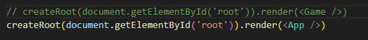

# Informe: Laboratorio 5

- Jared Sebastian Farfan Guevara.

## Descripción general

Tutorial de ReactJs y creación de un tablero interactivo que permitiendo a múltiples usuarios dibujar en el , usando socketIo para la comunicacion entre el frontend y backend.

Se realizo el tutoria de ReactJs para una pequeña implementacion con el juego de tic tac toe se puede correr solo con encender el servidor de fornt y cambiarl el archivo `main.jsx`.

---

### Tic Tac Toe 

Se siguieron los pasos del [tutorial](https://react.dev/learn/tutorial-tic-tac-toe)  para la implementación del juego de tic tac toe.

### Canvas con P5

Se creo el canvas con p5 en el archivo `p5.jsx` como indica el documento del laboratorio, al probrar se puede notar un tresado e inconsistencia en trazos que se hagan demasiado rapido, 