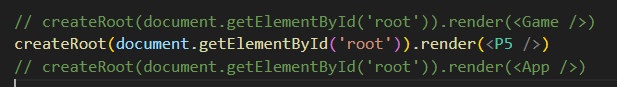
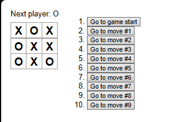
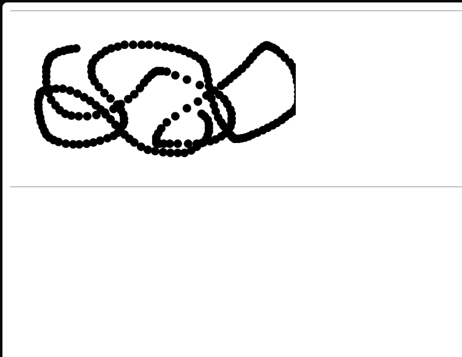
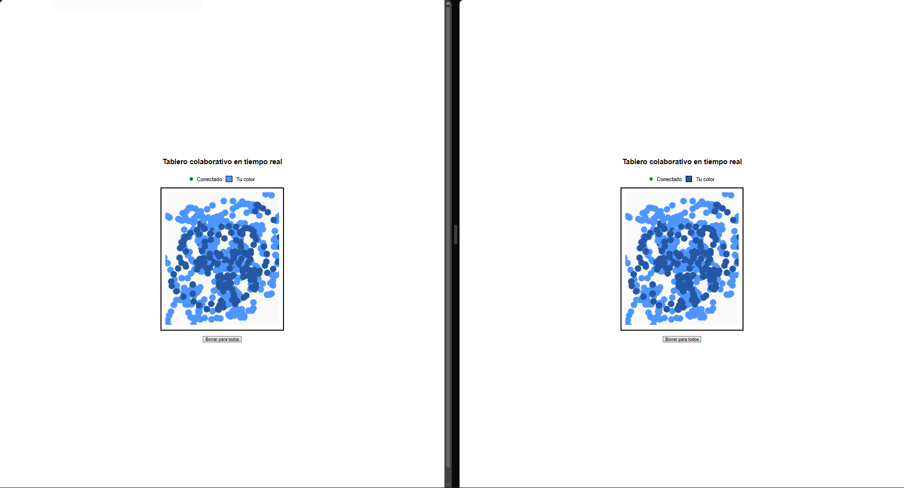
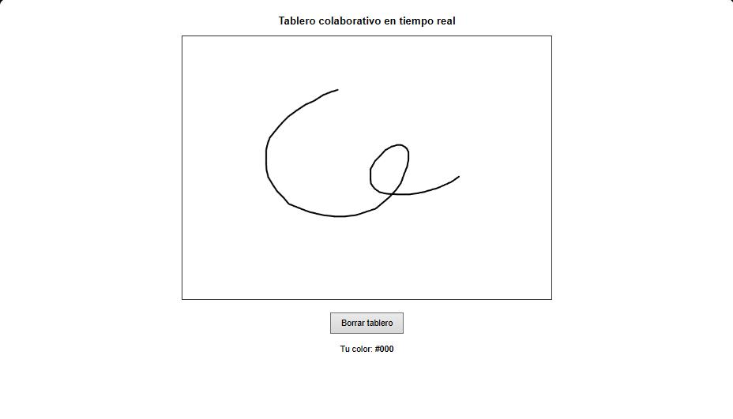
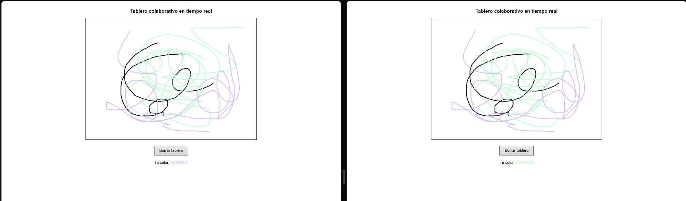

# Informe: Laboratorio 5 - FRONT

- Jared Sebastian Farfan Guevara.

- [Back](https://github.com/Jared-Farfan/Lab_5_BACK_ARSW_2026-1)

## Descripción general

Tutorial de ReactJs (Tic tac teo) y creación de un tablero interactivo que permitiendo a múltiples usuarios dibujar en el , usando spring y socketIo para la comunicacion entre el frontend y backend.

---

### Tic Tac Toe 

Se siguieron los pasos del [tutorial](https://react.dev/learn/tutorial-tic-tac-toe)  para la implementación del juego de tic tac toe, se puede ver el codigo en el archivo `tictactoe.jsx`, para ejecutar:.

- Verifica que en el arichivo main.jsx estes usando el `Game`
- Ejecutar front `npm i`,  `npm run dev`

### Canvas con P5

Se creo el canvas con p5 en el archivo `p5.jsx` como indica el documento del laboratorio, al probrar se puede notar un tresado e inconsistencia en trazos que se hagan demasiado rapido, 

- Verifica que en el arichivo main.jsx estes usando el `P5`
- Ejecutar front `npm i`,  `npm run dev`
- Ejecutar [Back](https://github.com/Jared-Farfan/Lab_5_BACK_ARSW_2026-1), `cd Lab_5_back_spring`, `mvn clean install` y `.\mvnw spring-boot:run`

### Canvas con Socket.io

En el archivo `App.jsx` se creo un canvas interactivo el cual depende del backend realizado en node para ser colavorativo, pasos para usar:

- Verifica que en el arichivo main.jsx estes usando el `App`
- Ejecutar front `npm i`,  `npm run dev`
- Ejecutar [Back](https://github.com/Jared-Farfan/Lab_5_BACK_ARSW_2026-1), `cd Lab_5_back_node`, `npm i` y `npm run start`

